| Antony Palacios | Gustavo Rodriguez | Cristhopher Alcivar | Diego Flores | Ian Velez | Isaac Joviric |
| ------ | ------ | ------ | ------ |  ------ | ------ |
|<p align="center"><a href="https://github.com/byotony"></a></p>|<p align="center"><a href="https://github.com/gusrsl"></a></p>|<p align="center"><a href="https://github.com/krixsjdk"></a></p>|<p align="center"><a href="https://github.com/diegoflores16"></a></p>|<p align="center"><a href="https://github.com/e1313326363"></a></p>|<p align="center"><a href="https://github.com/IsaacJ95"></a></p>|

## Testing

### 1er Paso.
#### Definimos las variables las cuales se van a testear.
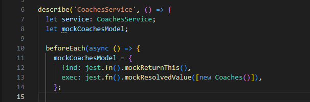

### 2do Paso.
#### En el Act detallamos todo el testeo que se realizará, hay que tener en cuenta los factores de "Proviers" que es el encargado de llamar al servicio que se quiera testear, y los mocker de usan para ayudarnos a definir variables de mongo a través de tokens
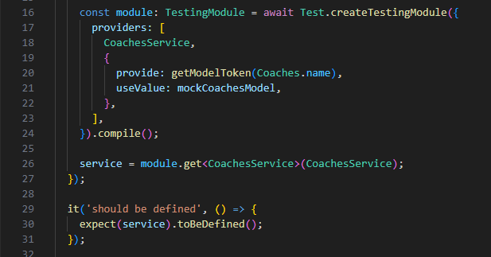

### 3er Paso.
#### El assert que es el encargado de ejecutar el testeo, esto lo logramos usando la función describe sobre el findAll
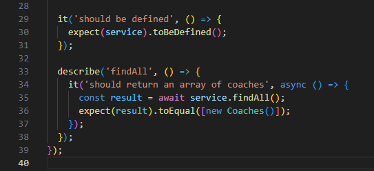

## Luego Procedemos a la Dockerizar 

### 1er Paso
#### Configuramos el Dockerfile
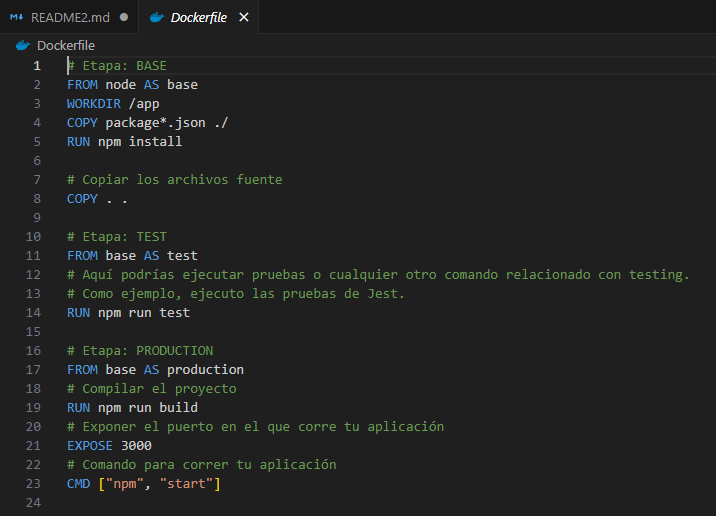

### 2do Paso
#### Ejecutamos todos los Test del proyecto
```sh
  npm test
```
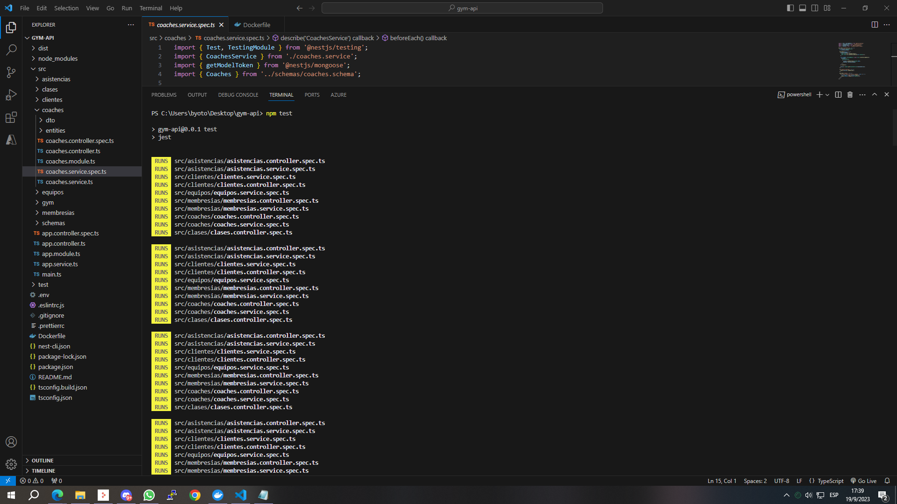

### 3er Paso
#### Creamos la imagen del docker pero con referencia al Test
```sh
    docker build --target test -t mi-backend:test .  
```    
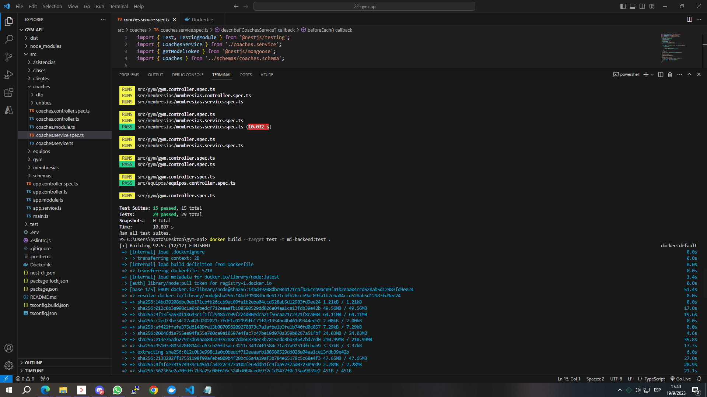

### 4to Paso
#### Creamos la imagen del docker completa
```sh
    docker build -t mi-backend:latest .
``` 
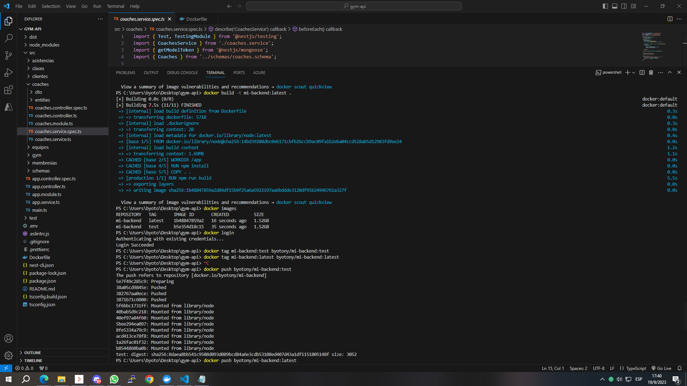

### 5to Paso
#### Revisamos las imagenes creadas 
```sh
    docker images
``` 
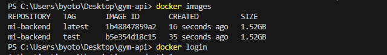

### 6to Paso
#### Nos Logueamos en docker
```sh
    docker login
``` 


### 7to Paso
#### Etiquetar las imágenes con tu nombre de usuario de Docker Hub, antes de poder subir tus imágenes a Docker Hub.
```sh
  docker tag mi-backend:test byotony/mi-backend:test
  docker tag mi-backend:latest byotony/mi-backend:latest
```
#### Subir las imágenes a Docker Hub
```sh
  docker push byotony/mi-backend:test
  docker push byotony/mi-backend:latest
```
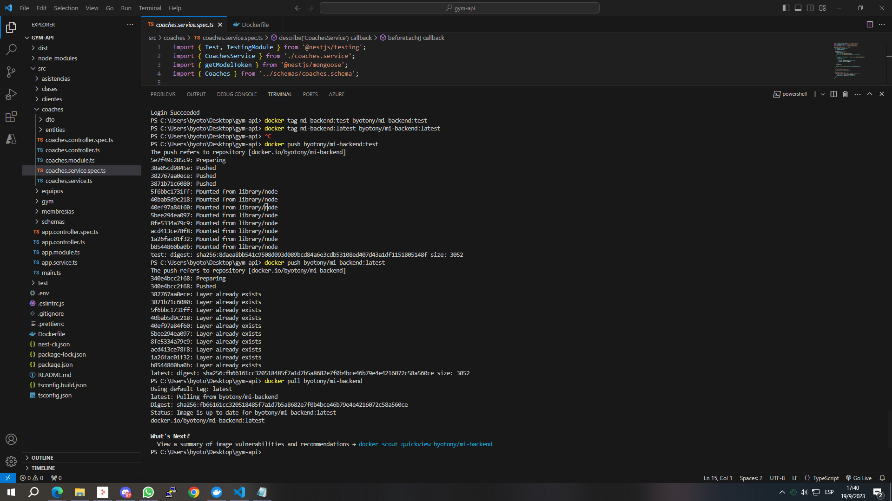

### 8vo Paso
#### Por ultimo hacemos el Docker Publico
```sh
  docker push byotony/mi-backend
```
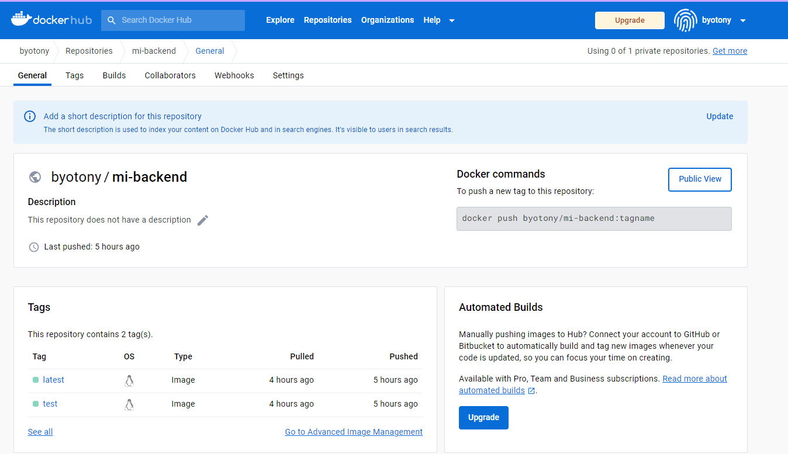

### 9no Paso
#### Ejecutamos la imagen bajada del docker del test y Observamos que funcione correctamente


#### Tambien podemos observar la imagen completa y Observamos que funcione correctamente
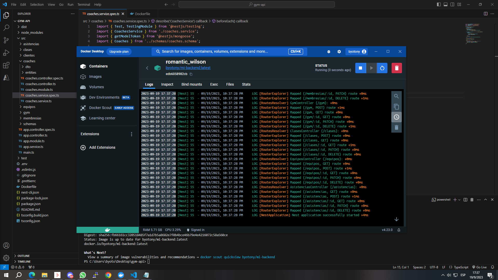

### 10mo Paso
#### Observamos todas las imagenes bajadas y creadas
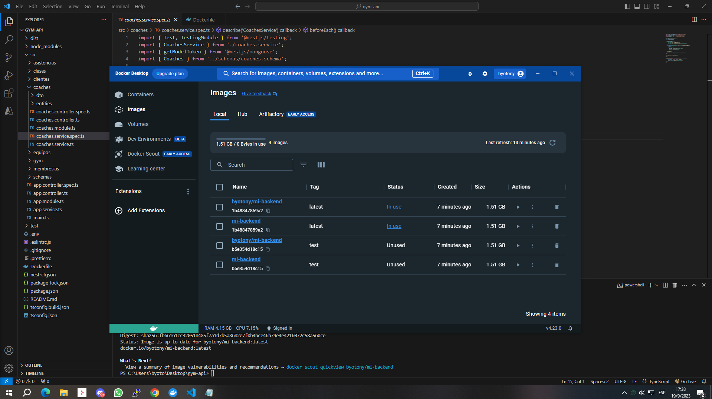

#### Observamos las imagenes subida en Docker Hub
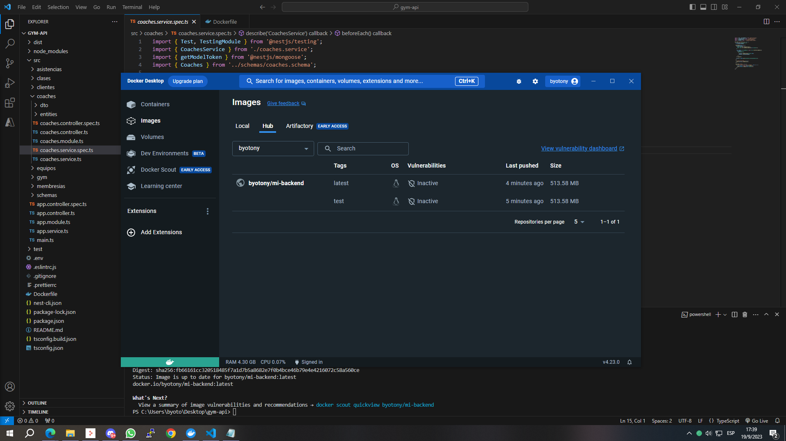